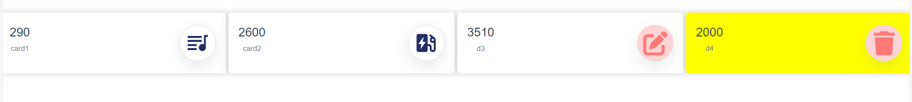

## Dynamic Vuejs2 Card Component

<!--  -->

📃 This template should help you get started with Vue js development as a ready-made components for displaying your stats in a form card ,
You only give it the data necessary to display it, such as the number, title, and icon, and it completes the task successfully. You can also add your own touch to it.

🛑 This component was created using vuejs2 technology and only works on projects of the same Version vuejs 2. It will be updated later to the next version and other components will be created that will help you and facilitate the process of building your web applications.

## Demo

Discover [Demo](https://amtabledemo.netlify.app/CadrView).

## Features

- Dynamic
- This component enables you to control and dynamically change your digital data and statistics

- Responsive Design

  - Its design is compatible with all phone screens, tablets and computers

- The icon can be changed according to your need

- You can add your own touch to the card style by adding a CSS class

## Installation

Install amtablevuecomponenet with npm

```bash or terminal
  npm install dynamic_cards_componenets
  npm i dynamic_cards_componenets
```

## Available props

| Attribute |       Type       |   Default | required |                                                            description                                                             |
| :-------- | :--------------: | --------: | :------- | :--------------------------------------------------------------------------------------------------------------------------------: |
| data      | Array of objects | null , [] | true     | This attribute specifies the data that will be displayed in the card and contains all the information that the component will need |

## Explanation of using data props

Here we define the compoenent data

        cardsdata:
        [
        {
        // The first card
        title: "card1" // Card Title,
        number: 290, // The number that is displayed on the card,
        icon: "bx bxs-playlist" // Icon class : You can use any class icon from icons that you use in your project example fontawesome etc,
        },
        {
         // The second card

            title: "card2",
            number: 2600,
            icon: "bx bxs-ev-station",
          },
          {
             // The third card
            title: "d3",
            number: 3500,
            icon: "fa fa-edit",
            iconId: "cube",
          },
          {
             // The fourth  card
            title: "d4",
            number: 2000,
            icon: "fa-solid fa-trash",
            iconId: "cube" // icon id if you want to change the icon style like background color and other things,
            cardclass: "FrCardclass" // card css class if you want to change card style  and other things,
          },
        ],

## Usage/Examples

```html
<template>
  <div id="app">
    <card :data="cardsdata" />
  </div>
</template>

<script>
  // import cardcomponenet
  import card from "dynamic_cards_componenets";
  // import card css style
  import "dynamic_cards_componenets/dist/card-component.css";

  export default {
    name: "App",
    data() {
      // declare card data
      return {
        cardsdata: [
          {
            title: "card1",
            number: 290,
            icon: "bx bxs-playlist",
          },
          {
            title: "card2",
            number: 2600,
            icon: "bx bxs-ev-station",
          },
          {
            title: "d3",
            number: 3500,
            icon: "fa fa-edit",
            iconId: "cube",
          },
          {
            title: "d4", // Card Title,
            number: 2000, // The number that is displayed on the card,
            icon: "fa-solid fa-trash", // Icon class : You can use any class icon from icons that you use in your project example fontawesome etc,
            iconId: "cube", // icon id if you want to change the icon style like background color and other things
            cardclass: "FrCardclass", // card css class if you want to change card style  and other things,
          },
        ],
      };
    },
    components: {
      card,
    },
  };
</script>

<style>
  /* ============ Use iconId and cardclass to make some style changes ========== */

  #cube {
    background-color: #ffd4d4;
    color: #ff7979;
  }
  #cube:hover {
    background-color: #de6b6b;
  }

  .FrCardclass {
    background: yellow;
  }
</style>
```

## Final result


## 🔗 Links

[](https://main--abderrahmaneamerrhiportfoliov2.netlify.app/)
[](https://www.linkedin.com/in/abderrahmane-amerrhi-807b40201/)
